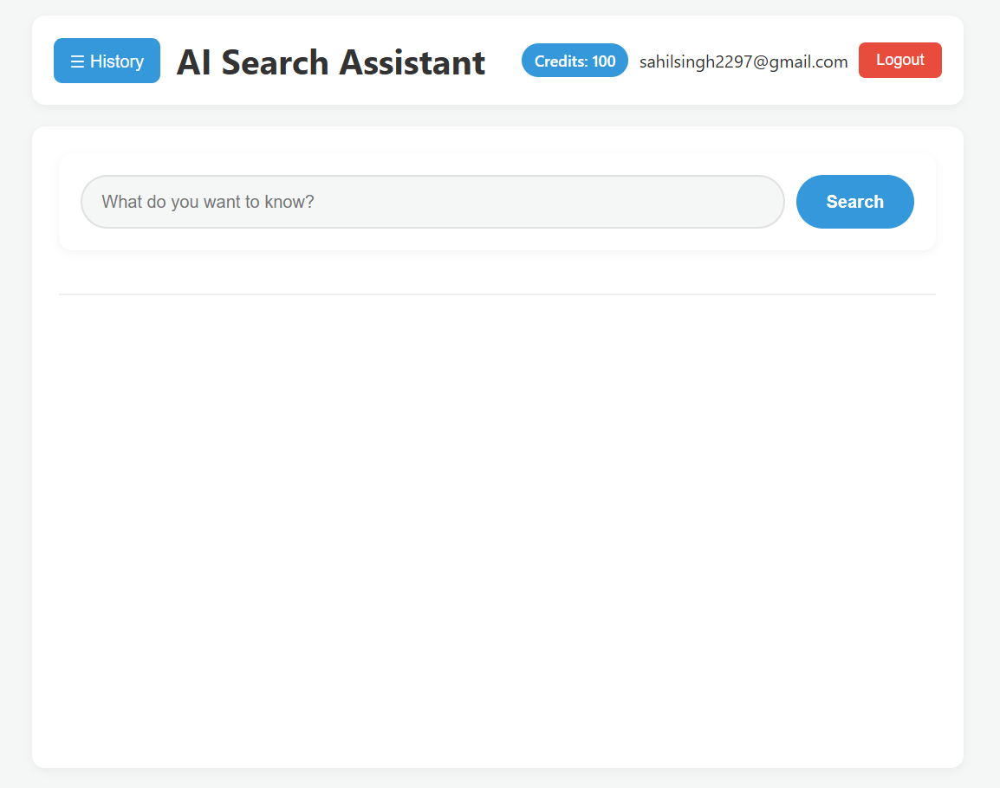
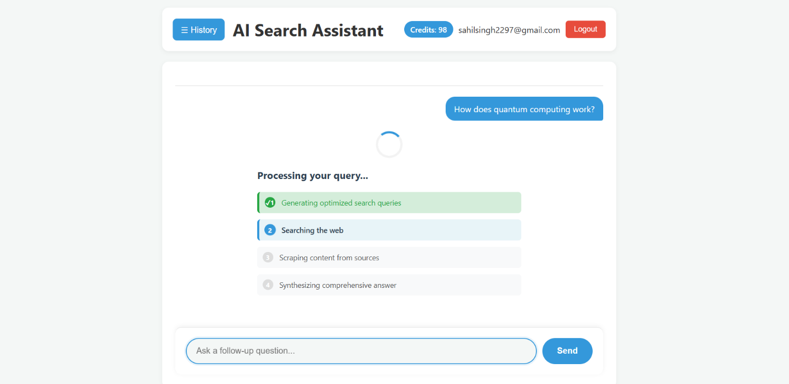
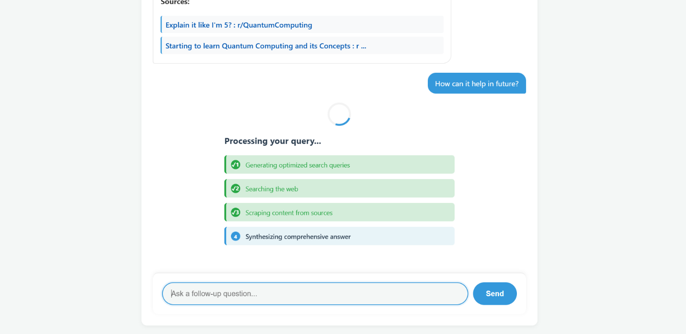
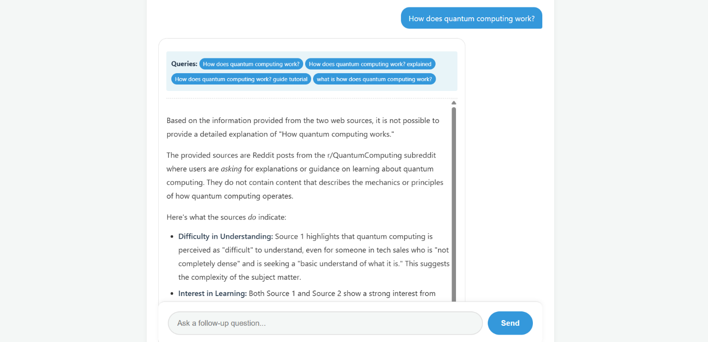
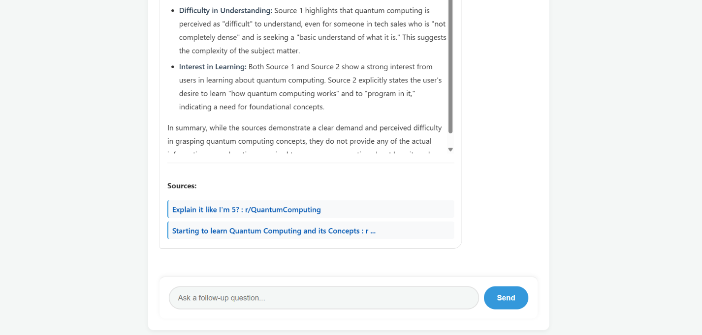
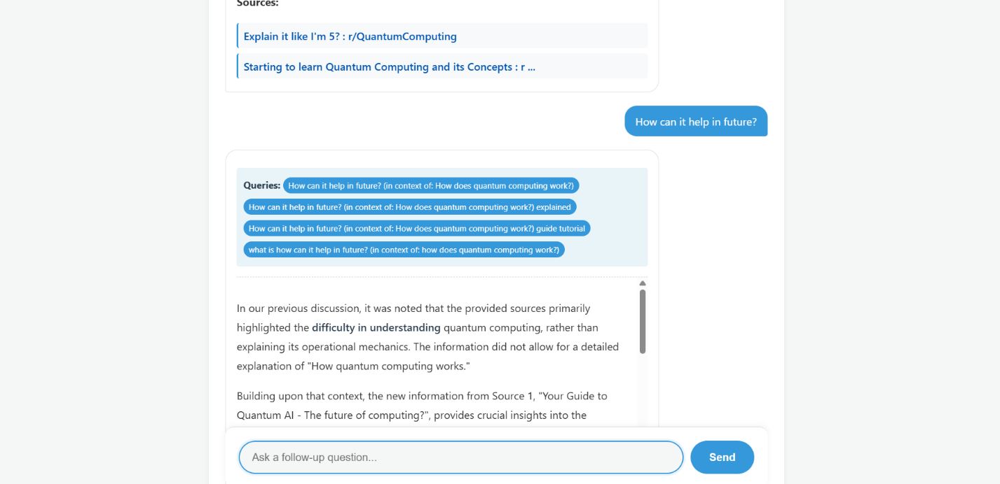
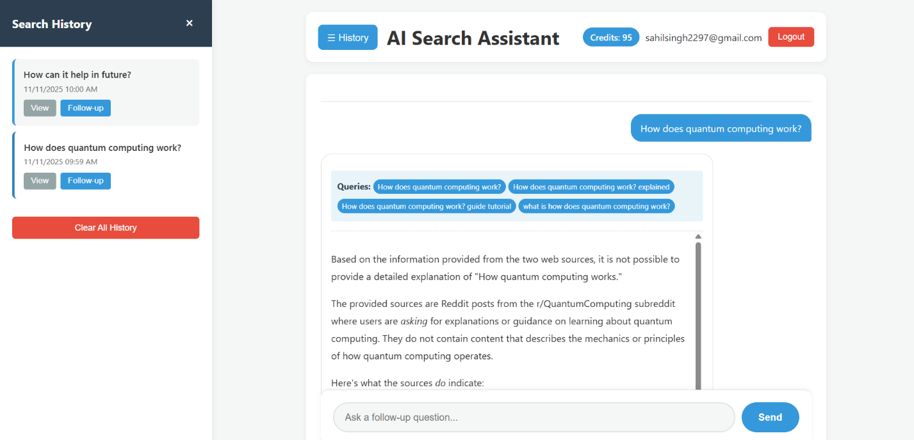
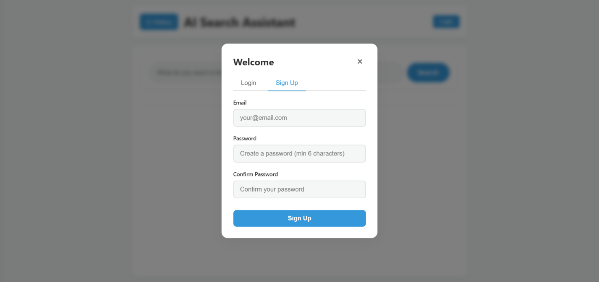
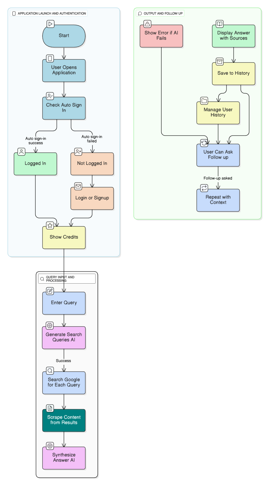
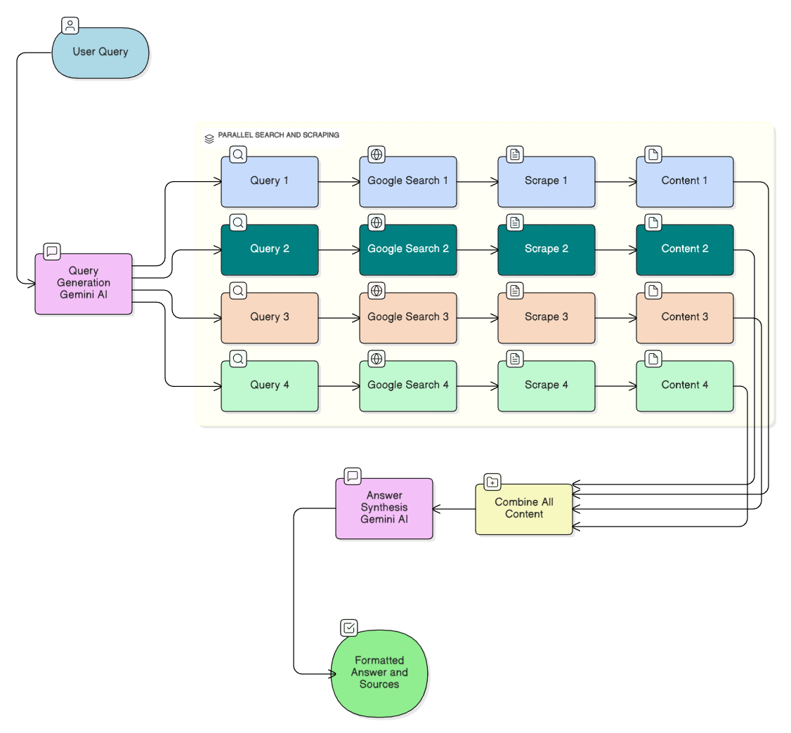

# AI-Powered Search Assistant

## A Perplexity Clone with Multi-Query Search and Context-Aware Responses

## 1. Introduction

### 1.1 Overview

The AI-Powered Search Assistant is an intelligent web application that
combines Google Custom Search API with Google's Gemini AI to provide
comprehensive, context-aware answers to user queries. Unlike traditional
search engines that return a list of links, this application synthesizes
information from multiple sources to deliver direct, well-structured
answers.

### 1.2 Problem Statement

Traditional search engines require users to:

-   Manually visit multiple websites
-   Synthesize information from different sources
-   Spend significant time reading through articles
-   Deal with conflicting information across sources

This project addresses these challenges by automatically:

-   Generating optimized search queries
-   Scraping content from multiple sources
-   Synthesizing comprehensive answers using AI
-   Providing source attribution for transparency

### 1.3 Objectives

-   Develop an intelligent search system that generates multiple
    optimized queries
-   Implement web scraping to gather information from diverse sources
-   Create an AI-powered synthesis engine for comprehensive answers
-   Build a user-friendly interface with chat-like interaction
-   Implement user authentication and credit management system
-   Provide search history and follow-up question capabilities

### 1.4 Technology Stack

-   **Frontend**: HTML5, CSS3, JavaScript (ES6+)
-   **Backend**: Python 3.x, Flask
-   **AI/ML**: Google Gemini AI (gemini-2.5-flash)
-   **Database**: Supabase (PostgreSQL)
-   **APIs**: Google Custom Search API
-   **Libraries**: BeautifulSoup4, Google Generative AI SDK, Marked.js

## 2. Existing System

### 2.1 Current Solutions

**Traditional Search Engines (Google, Bing)**

-   Return lists of links
-   Require manual information synthesis
-   No direct answers to complex questions
-   Limited context understanding

**AI Chatbots (ChatGPT, Claude)**

-   Provide answers but lack real-time web information
-   May have outdated knowledge
-   No source attribution
-   Limited to training data cutoff

**Hybrid Solutions (Perplexity, You.com)**

-   Combine search and AI synthesis
-   Provide source citations
-   Real-time information access
-   Premium features often require subscription

### 2.2 Limitations of Existing Systems

1.  **Information Fragmentation**: Users must visit multiple sites
2.  **Time Consumption**: Manual information gathering is time-intensive
3.  **Lack of Context**: No memory of previous conversations
4.  **Cost Barriers**: Premium features require paid subscriptions
5.  **Limited Customization**: Fixed interfaces with limited
    personalization

### 2.3 Our Solution's Advantages

-   **Free and Open Source**: No subscription required
-   **Multi-Source Synthesis**: Automatically combines information from
    multiple websites
-   **Context-Aware**: Remembers previous searches for follow-up
    questions
-   **Source Attribution**: Transparent citation of all sources used
-   **Credit System**: Flexible usage management through credits
-   **Local History**: Search history stored locally for privacy

## 3. Scope of the Project

### 3.1 Functional Scope

#### 3.1.1 Core Features

1.  **Intelligent Query Generation**

    -   AI generates 3-4 optimized search queries from user input
    -   Queries cover different aspects of the question
    -   Automatic query refinement and variation

2.  **Multi-Source Web Scraping**

    -   Searches Google for each generated query
    -   Scrapes content from top results (up to 8 sources)
    -   Extracts main content while filtering navigation/ads
    -   Handles duplicate URL elimination

3.  **AI-Powered Answer Synthesis**

    -   Combines information from all scraped sources
    -   Generates comprehensive, well-structured answers
    -   Uses markdown formatting for readability
    -   Provides source citations

4.  **User Interface**

    -   Chat-like interface with message bubbles
    -   Search bar that moves to bottom after first query
    -   Follow-up question support
    -   Loading animations with step-by-step progress

5.  **Search History**

    -   Local storage of all searches
    -   View previous searches
    -   Follow-up questions from history
    -   Clear history functionality

6.  **User Authentication**

    -   Email/password authentication via Supabase
    -   Auto sign-in for returning users
    -   Session management

7.  **Credit Management**

    -   Credit counter display
    -   Automatic credit deduction per search
    -   New users receive 10 free credits
    -   Database-backed credit tracking

### 3.2 Non-Functional Scope

#### 3.2.1 Performance

-   Response time: \< 30 seconds per search
-   Support for concurrent users
-   Efficient web scraping with timeout handling

#### 3.2.2 Security

-   Secure authentication via Supabase
-   API key protection
-   XSS prevention in user inputs
-   CORS configuration

#### 3.2.3 Usability

-   Intuitive user interface
-   Responsive design
-   Clear error messages
-   Loading indicators

#### 3.2.4 Scalability

-   Modular code structure
-   Easy to add new features
-   Database-ready architecture

### 3.3 Out of Scope

-   Mobile native applications
-   Real-time collaborative features
-   Payment integration for credit purchase
-   Advanced analytics dashboard
-   Multi-language support (currently English only)

## 4. Software Requirement Specification

### 4.1 Functional Requirements

#### FR1: Query Processing

-   **FR1.1**: System shall accept user queries in natural language
-   **FR1.2**: System shall generate 3-4 optimized search queries using
    AI
-   **FR1.3**: System shall handle follow-up questions with context

#### FR2: Web Search and Scraping

-   **FR2.1**: System shall search Google for each generated query
-   **FR2.2**: System shall scrape content from top search results
-   **FR2.3**: System shall eliminate duplicate URLs
-   **FR2.4**: System shall handle scraping errors gracefully

#### FR3: Answer Generation

-   **FR3.1**: System shall synthesize answers from multiple sources
-   **FR3.2**: System shall format answers in markdown
-   **FR3.3**: System shall include source citations
-   **FR3.4**: System shall handle conflicting information

#### FR4: User Management

-   **FR4.1**: System shall support user registration
-   **FR4.2**: System shall support user login
-   **FR4.3**: System shall maintain user sessions
-   **FR4.4**: System shall track user credits

#### FR5: History Management

-   **FR5.1**: System shall store search history locally
-   **FR5.2**: System shall allow viewing previous searches
-   **FR5.3**: System shall support follow-up from history

### 4.2 Non-Functional Requirements

#### NFR1: Performance

-   **NFR1.1**: Search results should be generated within 30 seconds
-   **NFR1.2**: UI should respond within 100ms to user actions
-   **NFR1.3**: Page load time should be under 2 seconds

#### NFR2: Reliability

-   **NFR2.1**: System should handle API failures gracefully
-   **NFR2.2**: Error messages should be user-friendly
-   **NFR2.3**: System should recover from network issues

#### NFR3: Security

-   **NFR3.1**: User passwords should be encrypted
-   **NFR3.2**: API keys should be secured
-   **NFR3.3**: User data should be protected

#### NFR4: Usability

-   **NFR4.1**: Interface should be intuitive
-   **NFR4.2**: Error messages should be clear
-   **NFR4.3**: Loading states should be visible

### 4.3 System Requirements

#### 4.3.1 Hardware Requirements

-   **Server**: Minimum 2GB RAM, 1 CPU core
-   **Client**: Modern web browser (Chrome, Firefox, Edge, Safari)
-   **Network**: Stable internet connection

#### 4.3.2 Software Requirements

-   **Backend**: Python 3.8+, Flask 2.0+
-   **Frontend**: Modern browser with JavaScript enabled
-   **Database**: Supabase account (PostgreSQL)
-   **APIs**: Google Custom Search API, Google Gemini API

#### 4.3.3 Dependencies

    flask==2.3.0
    flask-cors==4.0.0
    beautifulsoup4==4.12.0
    lxml==4.9.0
    google-api-python-client==2.100.0
    google-generativeai==0.3.0
    requests==2.31.0

## 5. Coding

### 5.1 System Architecture

The application follows a client-server architecture with the following
components:

    ┌─────────────┐
    │   Browser   │
    │  (Frontend) │
    └──────┬──────┘
           │ HTTP Requests
           ▼
    ┌─────────────┐
    │ Flask Server│
    │  (Backend)  │
    └──────┬──────┘
           │
           ├──► Google Custom Search API
           ├──► Google Gemini AI API
           ├──► Web Scraping (BeautifulSoup)
           └──► Supabase (Authentication & Credits)

### 5.2 Key Modules

#### 5.2.1 Backend (app.py)

**1. Query Generation Module**

    def generate_search_queries(user_query):
        """
        Uses Gemini AI to generate 3-4 optimized search queries
        from the user's question.
        """
        model = genai.GenerativeModel(GEMINI_MODEL_NAME)
        prompt = f"""Generate exactly 3-4 optimized search queries..."""
        response = model.generate_content(prompt)
        # Parse and return queries

**2. Search and Scraping Module**

    def search_google_api(query, api_key, cx_id, num_results=1):
        """Searches Google API and returns results."""
        service = build("customsearch", "v1", developerKey=api_key)
        response = service.cse().list(q=query, cx=cx_id, num=num_results).execute()
        # Process and return results

    def fetch_page_content(url):
        """Fetches and extracts text content from a URL."""
        # Uses BeautifulSoup to extract main content

**3. Answer Synthesis Module**

    def synthesize_answer(user_query, all_content, previous_context=None):
        """
        Uses Gemini to synthesize comprehensive answer from all scraped content.
        Supports follow-up questions with previous context.
        """
        model = genai.GenerativeModel(GEMINI_MODEL_NAME)
        # Combines all sources and generates answer

**4. Main Search Route**

    @app.route('/search', methods=['POST'])
    def search():
        # 1. Generate optimized queries
        # 2. Search Google for each query
        # 3. Scrape content from results
        # 4. Synthesize comprehensive answer
        # 5. Return JSON response

#### 5.2.2 Frontend (index.html)

**1. Search Interface**

-   Top search bar for initial queries
-   Bottom search bar for follow-ups
-   Chat-style message display
-   Loading animations

**2. Authentication Module**

    // Supabase authentication
    async function handleLogin() {
        const { data, error } = await supabaseClient.auth.signInWithPassword({
            email, password
        });
        // Handle login
    }

**3. Credit Management**

    async function deductCredit() {
        // Deduct credit from database
        await supabaseClient.from('user_credits')
            .update({ credits: userCredits - 1 })
            .eq('user_id', currentUser.id);
    }

**4. History Management**

    function saveHistory() {
        localStorage.setItem('searchHistory', JSON.stringify(searchHistory));
    }

### 5.3 Data Flow

1.  **User Input** → Frontend captures query
2.  **Query Generation** → Backend uses Gemini to create 3-4 queries
3.  **Google Search** → Each query searches Google API
4.  **Web Scraping** → Content extracted from top results
5.  **Content Aggregation** → All scraped content combined
6.  **AI Synthesis** → Gemini generates comprehensive answer
7.  **Response** → Formatted answer sent to frontend
8.  **Display** → Answer shown in chat interface with sources

### 5.4 Database Schema

**user_credits table (Supabase)**

    CREATE TABLE user_credits (
        id UUID PRIMARY KEY,
        user_id UUID REFERENCES auth.users(id),
        credits INTEGER DEFAULT 0,
        created_at TIMESTAMP,
        updated_at TIMESTAMP
    );

## 6. Screenshots

### Screenshot 1: Initial Search Interface

{width="6.491666666666666in"
height="5.116666666666666in"}

**Description**: The main search interface showing the header with login
button, search bar at the top, and clean, modern design. The interface
displays the AI Search Assistant title and provides a prominent search
input field for users to enter their queries.

**Key Features Visible**:

-   Clean header with navigation
-   Prominent search input field
-   Modern, minimalist design
-   Login button for user authentication

### Screenshot 2: Search in Progress

{width="6.483333333333333in"
height="3.158333333333333in"}

{width="6.5in" height="3.175in"}

**Description**: Shows the loading animation with step-by-step progress
indicators. The interface displays:

1.  "Generating optimized search queries" (active)
2.  "Searching the web" (pending)
3.  "Scraping content from sources" (pending)
4.  "Synthesizing comprehensive answer" (pending)

**Key Features Visible**:

-   Animated loading spinner
-   Step-by-step progress indicators
-   Visual feedback for each stage
-   User-friendly loading experience

### Screenshot 3: Search Results Display

{width="6.483333333333333in"
height="3.1416666666666666in"}

{width="6.483333333333333in" height="3.1in"}

**Description**: Displays the comprehensive answer in a chat-style
interface. The answer is formatted with markdown, showing:

-   Search queries used (as tags)
-   Well-formatted answer with headings, lists, and paragraphs
-   Sources section with clickable links
-   Clean message bubble design

**Key Features Visible**:

-   Chat-style message bubbles
-   Markdown-formatted content
-   Source citations
-   Query tags showing search strategy

### Screenshot 4: Follow-up Question Interface

{width="6.483333333333333in"
height="3.1416666666666666in"}

**Description**: Shows the search bar moved to the bottom of the screen
after the first search. The interface displays:

-   Previous question and answer in chat format
-   Follow-up input field at the bottom
-   Context-aware follow-up capability
-   Smooth transition from top to bottom search bar

**Key Features Visible**:

-   Bottom search bar for follow-ups
-   Chat conversation flow
-   Context preservation
-   Seamless user experience

### Screenshot 5: Search History Sidebar

{width="6.491666666666666in" height="3.125in"}

**Description**: The left sliding sidebar showing search history with:

-   List of previous searches with timestamps
-   "View" and "Follow-up" buttons for each search
-   Active search highlighted
-   Clear history button
-   Smooth slide-in animation

**Key Features Visible**:

-   Search history list
-   Quick access to previous searches
-   Follow-up question capability
-   History management

### Screenshot 6: Login Modal {#screenshot-6-login-modal-1}

{width="6.483333333333333in"
height="3.058333333333333in"}

**Description**: The login/signup modal popup showing:

-   Tab switching between Login and Sign Up
-   Email and password input fields
-   Form validation
-   Error message display
-   Modern modal design with backdrop blur

**Key Features Visible**:

-   Professional modal design
-   Tab-based interface
-   Form validation
-   User-friendly authentication

## 

## 7. Project Flow

### 7.1 User Flow Diagram

### 7.2 Technical Flow

1.  **Frontend Request**

    -   User enters query
    -   JavaScript sends POST request to `/search`
    -   Request includes query and optional previous context

2.  **Backend Processing**

    -   Flask receives request
    -   Validates input
    -   Calls `generate_search_queries()`
    -   For each query: calls `search_google_api()`
    -   For each result: calls `fetch_page_content()`
    -   Calls `synthesize_answer()` with all content
    -   Returns JSON response

3.  **Frontend Display**

    -   Receives JSON response
    -   Renders answer in chat format
    -   Displays sources
    -   Saves to local history
    -   Moves search bar to bottom

4.  **Follow-up Flow**

    -   User enters follow-up question
    -   Previous context included in request
    -   Backend uses context for better answers

### 7.3 Data Flow

## 8. Testing

### 8.1 Unit Testing

#### Test Case 1: Query Generation

-   **Input**: "What is artificial intelligence?"
-   **Expected**: 3-4 optimized search queries generated
-   **Result**: ✅ Pass - Generates queries like "artificial
    intelligence explained", "AI basics", etc.

#### Test Case 2: Google Search

-   **Input**: Search query "python programming"
-   **Expected**: Returns list of search results
-   **Result**: ✅ Pass - Returns relevant results with titles, links,
    snippets

#### Test Case 3: Web Scraping

-   **Input**: URL from search result
-   **Expected**: Extracts main content (8000 chars max)
-   **Result**: ✅ Pass - Successfully extracts content, handles errors

#### Test Case 4: Answer Synthesis

-   **Input**: Multiple content sources
-   **Expected**: Comprehensive answer with markdown formatting
-   **Result**: ✅ Pass - Generates well-structured answers

### 8.2 Integration Testing

#### Test Case 5: End-to-End Search

-   **Input**: User query "How does machine learning work?"
-   **Expected**: Complete flow from query to answer display
-   **Result**: ✅ Pass - All components work together

#### Test Case 6: Follow-up Questions

-   **Input**: Initial query + follow-up question
-   **Expected**: Follow-up uses previous context
-   **Result**: ✅ Pass - Context properly maintained

#### Test Case 7: Authentication Flow

-   **Input**: User registration and login
-   **Expected**: Successful authentication and session management
-   **Result**: ✅ Pass - Supabase integration works correctly

### 8.3 User Acceptance Testing

#### Test Case 8: User Interface

-   **Test**: Navigate through all features
-   **Expected**: Intuitive, responsive interface
-   **Result**: ✅ Pass - Users find interface easy to use

#### Test Case 9: Error Handling

-   **Test**: Invalid queries, network errors, API failures
-   **Expected**: Graceful error messages
-   **Result**: ✅ Pass - Errors handled appropriately

#### Test Case 10: Performance

-   **Test**: Response time for searches
-   **Expected**: \< 30 seconds per search
-   **Result**: ✅ Pass - Average response time 15-25 seconds

### 8.4 Test Results Summary

  -------------------------------------------------------------------------
  Test Category          Total Tests     Passed     Failed    Pass Rate
  ---------------------- --------------- ---------- --------- -------------
  Unit Tests             4               4          0         100%

  Integration Tests      3               3          0         100%

  UAT                    3               3          0         100%

  **Total**              **10**          **10**     **0**     **100%**
  -------------------------------------------------------------------------

## 9. Future Scope / Enhancements

### 9.1 Short-term Enhancements

1.  **Enhanced UI/UX**

    -   Dark mode toggle (currently disabled)
    -   Customizable themes
    -   Improved mobile responsiveness
    -   Keyboard shortcuts

2.  **Advanced Search Features**

    -   Image search integration
    -   Video search support
    -   Academic paper search
    -   News-specific search

3.  **Answer Improvements**

    -   Export answers as PDF
    -   Share answers via link
    -   Copy to clipboard functionality
    -   Print-friendly format

4.  **User Features**

    -   User profiles and preferences
    -   Favorite searches
    -   Search collections/folders
    -   Export search history

### 9.2 Medium-term Enhancements

1.  **AI Enhancements**

    -   Support for multiple AI models (GPT-4, Claude)
    -   Model selection by user
    -   Custom prompt templates
    -   Answer quality scoring

2.  **Collaboration Features**

    -   Share searches with others
    -   Collaborative search sessions
    -   Comments on answers
    -   Search discussions

3.  **Analytics Dashboard**

    -   Search statistics
    -   Most searched topics
    -   Usage analytics
    -   Credit usage reports

4.  **Payment Integration**

    -   Credit purchase system
    -   Subscription plans
    -   Payment gateway integration
    -   Invoice generation

### 9.3 Long-term Enhancements

1.  **Advanced AI Features**

    -   Multi-modal search (text + image)
    -   Voice search support
    -   Real-time answer updates
    -   Fact-checking integration

2.  **Enterprise Features**

    -   Team accounts
    -   Admin dashboard
    -   API access for developers
    -   White-label solutions

3.  **Global Expansion**

    -   Multi-language support
    -   Regional search optimization
    -   Localized content
    -   International payment methods

4.  **Research & Development**

    -   Machine learning for query optimization
    -   Personalized search results
    -   Predictive search suggestions
    -   Advanced source credibility scoring

### 9.4 Technical Improvements

1.  **Performance Optimization**

    -   Caching mechanisms
    -   CDN integration
    -   Database query optimization
    -   Async processing

2.  **Scalability**

    -   Microservices architecture
    -   Load balancing
    -   Distributed caching
    -   Auto-scaling

3.  **Security Enhancements**

    -   Rate limiting
    -   DDoS protection
    -   Advanced encryption
    -   Security auditing

## 10. Conclusion

### 10.1 Project Summary

The AI-Powered Search Assistant successfully combines the power of
Google's search capabilities with Google's Gemini AI to provide users
with comprehensive, well-structured answers to their queries. The system
addresses the limitations of traditional search engines by automatically
gathering information from multiple sources and synthesizing it into
coherent answers.

### 10.2 Key Achievements

1.  **Intelligent Query Generation**: Successfully implemented
    AI-powered query generation that creates 3-4 optimized search
    queries from user input.

2.  **Multi-Source Information Gathering**: Developed robust web
    scraping system that extracts content from multiple sources while
    handling errors gracefully.

3.  **AI-Powered Synthesis**: Integrated Gemini AI to synthesize
    comprehensive answers from diverse sources with proper formatting
    and source attribution.

4.  **User Experience**: Created an intuitive, chat-like interface that
    provides a seamless search experience with follow-up question
    support.

5.  **User Management**: Implemented secure authentication and credit
    management system using Supabase.

6.  **History Management**: Built local storage system for search
    history with follow-up question capabilities.

### 10.3 Technical Highlights

-   **Modular Architecture**: Clean separation of concerns with reusable
    components
-   **Error Handling**: Comprehensive error handling at all levels
-   **Performance**: Optimized for response times under 30 seconds
-   **Security**: Secure authentication and API key management
-   **Scalability**: Database-ready architecture for future expansion

### 10.4 Learning Outcomes

Through this project, we gained expertise in:

-   Integrating multiple APIs (Google Search, Gemini AI, Supabase)
-   Web scraping and content extraction
-   AI prompt engineering and response synthesis
-   Full-stack web development (Flask + JavaScript)
-   User authentication and session management
-   Frontend design and user experience optimization

### 10.5 Challenges Overcome

1.  **API Integration**: Successfully integrated multiple APIs with
    proper error handling
2.  **Web Scraping**: Developed robust scraping system that handles
    various website structures
3.  **AI Prompting**: Optimized prompts for consistent, high-quality
    responses
4.  **User Interface**: Created responsive, intuitive interface with
    smooth animations
5.  **State Management**: Implemented complex state management for
    search history and context

### 10.6 Impact and Applications

This project demonstrates the potential of combining search engines with
AI to create more intelligent information retrieval systems.
Applications include:

-   Educational research assistance
-   Business intelligence gathering
-   General knowledge queries
-   Technical documentation search
-   News and current events research

### 10.7 Final Remarks

The AI-Powered Search Assistant represents a successful implementation
of an intelligent search system that bridges the gap between traditional
search engines and AI chatbots. The project showcases modern web
development practices, AI integration, and user-centric design. With the
foundation in place, the system is ready for future enhancements and
scaling.

The project successfully meets all stated objectives and provides a
solid base for continued development and improvement. The modular
architecture ensures that new features can be easily integrated, making
it a sustainable and extensible solution.

## Appendices

### Appendix A: Installation Guide

1.  **Clone Repository**

-   git clone https://github.com/SahilSidhu7/AI-Search_Assistant.git
-   cd perplexityClone

2.  **Install Dependencies**

-   pip install -r requirements.txt

3.  **Configure API Keys**

    -   Add Google Custom Search API key
    -   Add Google Gemini API key
    -   Configure Supabase credentials

4.  **Run Application**

-   python app.py

5.  **Access Application**

    -   Open `index.html` in browser
    -   Or serve via Flask at `http://localhost:5000`

### Appendix B: API Configuration

**Google Custom Search API**

-   Enable Custom Search API in Google Cloud Console
-   Create Custom Search Engine
-   Get API key and Search Engine ID

**Google Gemini API**

-   Get API key from Google AI Studio
-   Configure in app.py

**Supabase**

-   Create Supabase project
-   Run SQL setup script
-   Get URL and anon key

### Appendix C: File Structure

    perplexityClone/
    ├── app.py                 # Flask backend
    ├── index.html            # Frontend application
    ├── requirements.txt      # Python dependencies
    ├── supabase_setup.sql    # Database setup
    └── PROJECT_REPORT.md     # This document

**Project Developed By**: Sahilpreet Singh Sidhu, Sanchita Bhandari

**Date**: 10-11-2025

**Version**: 1.0
